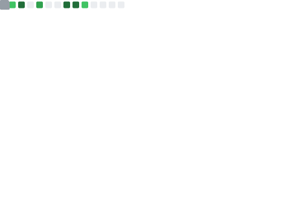

  

## Hey there, I'm Akshay 👋

I'm an AI Full Stack Engineer based in San Francisco, building things at the intersection of **infrastructure**, **AI**, and **product**. I believe great software is shipped fast, measured obsessively, and built with empathy. That's been my north star across startups, research labs, and enterprise — from genomics platforms to multi-agent RL systems to AI career coaches.

Right now, I'm shipping code at **[Softmax](https://softmax.com/)** and **[Climb Together](https://climbtogether.com)** — and I've been loving every commit. 🚀

  &nbsp;
  &nbsp;
  

---

## 🍿 What I'm building right now

### [Goldi](https://github.com/climb-together/goldi) — AI Career Coaching Platform @ Climb Together

Goldi is an AI-powered career coaching experience, and I'm the **#1 contributor**. Think of it as a coach that actually listens — with voice mode powered by Hume AI, emotional intelligence built in, and smart interruption handling. We partnered with **Walmart** to build custom onboarding flows targeting different career archetypes (Explorer, Directed, Networker), and shipped a **WhatsApp + SMS** consent & accountability system that drove **+28% re-engagement**. The playlist architecture is URL-driven, multi-playlist, with race condition fixes and navigation caching that just *works*.

> **Stack:** Next.js · Claude AI · Hume AI · WhatsApp/SMS integrations

### [Metta](https://github.com/Metta-AI/metta) — Open-Source Multi-Agent RL Platform @ Softmax

Metta is an open-source research platform for multi-agent reinforcement learning, and I own the **infra & platform layer**. I built a full **Datadog + OpenTelemetry** observability pipeline — metric emission, OTLP receivers, structured collectors that replaced a legacy SQLite setup. On the Kubernetes side, I wrote a watcher service for job lifecycle event processing and storage, plus Helm deploy fixes. Infrastructure-as-code lives in **Terraform** (Lambda, Secrets Manager, IAM for GitHub webhooks). I hardened the CI/CD pipeline with cancelled-run cleanup, failure classification (timeout / OOM / policy_error), and keep-main-green automation. And I set up **Alembic migrations** over PostgreSQL + SQLModel ORM for a 21-table schema.

> **Stack:** Python · Kubernetes · Terraform · AWS · Datadog · OpenTelemetry · PostgreSQL

---

## 🎯 Impact by the numbers

Here's what shipping fast and measuring everything actually looks like:

<table>
<tr>
<td align="center">⚡ <strong>-50%</strong> Lambda cold starts</td>
<td align="center">✅ <strong>99.9%</strong> Service uptime</td>
<td align="center">🎨 <strong>-40%</strong> First Contentful Paint</td>
<td align="center">🏎️ <strong>-55%</strong> API latency</td>
<td align="center">📱 <strong>+28%</strong> Re-engagement</td>
<td align="center">🧪 <strong>500+</strong> Tests written</td>
</tr>
</table>

---

## 🔧 Tech I work with

  
   
  

  
  
  
  
  
  

  
  
  
  

---

## 🦦 Featured work

<table>
<tr>
<td width="33%">
<a href="https://github.com/Metta-AI/metta"><strong>🧠 Metta</strong></a> 
Open-source multi-agent RL platform @ Softmax. Built the observability pipeline, CI/CD hardening, Terraform infra, and DB migrations.
</td>
<td width="33%">
<a href="https://github.com/climb-together/goldi"><strong>🎯 Goldi</strong></a> 
#1 contributor. AI career coaching with voice mode, Walmart partnership, playlist architecture. Next.js + Claude AI.
</td>
<td width="33%">
<a href="https://github.com/weng-lab/Factorbook2.0"><strong>🧬 Factorbook 2.0</strong></a> 
Genomics AI platform @ UMass Chan. Led the frontend rebuild — cut FCP by 40%, wrote 500+ tests, slashed API latency 55%.
</td>
</tr>
</table>

---

## 📊 GitHub stats

<!-- Base metrics: followers, commits, stars, PRs, issues, etc. -->

  

<!-- Isometric contribution calendar (full year) -->

  

<!-- Coding habits: commits by hour/day, languages breakdown -->

  

<!-- PRs opened/merged/reviewed & code review stats -->

  

<!-- Achievements & notable contributions -->

  

  

  
  
  

  
  

  

---

## 👓 A bit more about me

<strong>AI Full Stack Engineer</strong> — Softmax · Climb Together 
Previously @ UMass Chan Medical School · Capgemini (BMW) · tag8 · KPMG 
M.S. Computer Science, Clark University · AWS Certified Developer · San Francisco, CA 🌉

  <em>"Tell me more, I can't get enough!"</em> — check out my <a href="https://www.akshaykalapgar.com">portfolio</a> or just <a href="mailto:akshaykalapgar23@gmail.com">say hi</a>. I'm always down to chat about infra, AI, or why observability is underrated. ☕

