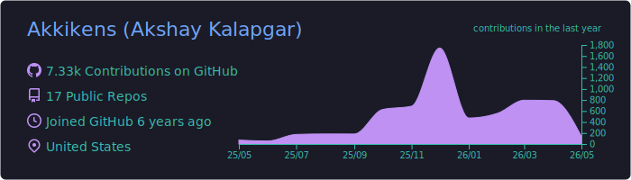
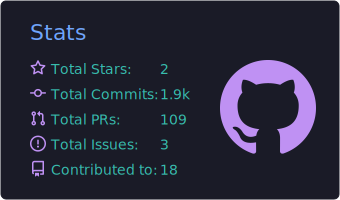
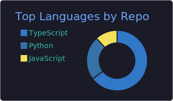
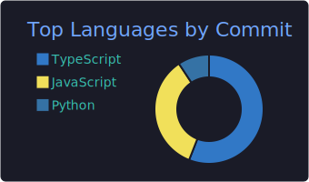
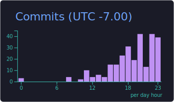

<div align="center">

<!-- Name & Title Block -->
<a href="https://www.akshaykalapgar.com">
  
</a>

<br/>


<br/><br/>

<!-- Social Links -->
<a href="https://linkedin.com/in/akshaykalapgar"></a>&nbsp;&nbsp;
<a href="https://www.akshaykalapgar.com"></a>&nbsp;&nbsp;
<a href="mailto:akshaykalapgar23@gmail.com"></a>&nbsp;&nbsp;
<a href="https://github.com/akkikens"></a>

<br/>

&nbsp;


</div>

<br/>

<!-- ═══════════════════════════════════════════════════════════════ -->

<div align="center">
<table><tr><td>
<br/>
<p align="center"><strong>I build at the intersection of infrastructure, AI, and product.</strong></p>
<p align="center">
Not the kind of engineer who picks a lane — the kind who builds the lane, instruments it,<br/>
and ships the product that drives on it. From Kubernetes watchers to voice-powered AI coaching,<br/>
from genomics platforms to multi-agent RL systems, I've spent my career proving that<br/>
<strong>the best engineers are the ones who care about the whole stack.</strong>
</p>
<br/>
</td></tr></table>
</div>

<br/>

<!-- ═══════════════════════════════════════════════════════════════ -->

## &nbsp;&nbsp; Now &mdash; Building the Future of Career Coaching

<table>
<tr>
<td width="100%">
<br/>

<h3 align="center"><a href="https://github.com/climb-together/goldi">Goldi</a> &mdash; AI Career Coaching &nbsp;|&nbsp; Climb Together</h3>

<p align="center">
&nbsp;
&nbsp;

</p>

Goldi is an AI career coach that actually listens. I'm the **#1 contributor**, building across the entire surface area:

**Voice Mode** &mdash; Emotional intelligence powered by **Hume AI** with smart interruption handling. The AI doesn't just respond — it reads tone, paces itself, and adapts.

**Walmart Partnership** &mdash; Custom onboarding flows for career archetypes (Explorer, Directed, Networker), tailored to one of the world's largest employers.

**WhatsApp + SMS System** &mdash; Consent and accountability messaging that drove **+28% re-engagement**. Not a notification — a conversation.

**Playlist Architecture** &mdash; URL-driven, multi-playlist system with race condition fixes and navigation caching that simply works.

<p align="center">


</p>

<br/>
</td>
</tr>
</table>

<br/>

<!-- ═══════════════════════════════════════════════════════════════ -->

## &nbsp;&nbsp; Previously &mdash; Where I Shipped

<table>
<tr>
<td width="50%" valign="top">
<br/>

<h3 align="center"><a href="https://github.com/Metta-AI/metta">Metta</a></h3>
<h4 align="center">Multi-Agent RL Platform &nbsp;|&nbsp; Softmax</h4>

<p align="center">

</p>

Open-source research platform for multi-agent reinforcement learning. I owned the **infrastructure and platform layer**:

&nbsp;&nbsp;&nbsp; **Observability** &mdash; Datadog + OpenTelemetry pipeline. Metric emission, OTLP receivers, structured collectors replacing legacy SQLite.

&nbsp;&nbsp;&nbsp; **Kubernetes** &mdash; Watcher service for job lifecycle events. Helm deploy fixes.

&nbsp;&nbsp;&nbsp; **Terraform IaC** &mdash; Lambda, Secrets Manager, IAM for GitHub webhooks.

&nbsp;&nbsp;&nbsp; **CI/CD** &mdash; Cancelled-run cleanup, failure classification (timeout / OOM / policy_error), keep-main-green automation.

&nbsp;&nbsp;&nbsp; **Database** &mdash; Alembic migrations over PostgreSQL + SQLModel ORM for a 21-table schema.

<p align="center">


</p>

<br/>
</td>
<td width="50%" valign="top">
<br/>

<h3 align="center"><a href="https://github.com/weng-lab/Factorbook2.0">Factorbook 2.0</a></h3>
<h4 align="center">Genomics AI Platform &nbsp;|&nbsp; UMass Chan Medical School</h4>

<p align="center">

</p>

Led the complete frontend rebuild of a genomics AI platform used by researchers. Performance was the product:

<br/>

<div align="center">

| &nbsp; | Metric | Impact |
|:---:|:---|:---|
| **FCP** | First Contentful Paint | **-40%** |
| **API** | Response Latency | **-55%** |
| **Cold** | Lambda Cold Starts | **-50%** |
| **SLA** | Service Uptime | **99.9%** |
| **QA** | Tests Written | **500+** |

</div>

<br/>

<p align="center">


</p>

<br/>
</td>
</tr>
</table>

<details>
<summary><strong>&nbsp;&nbsp; Earlier Career</strong> &mdash; Capgemini (BMW) &middot; tag8 &middot; KPMG</summary>
<br/>
<p>&nbsp;&nbsp;&nbsp;&nbsp;Full stack engineering across enterprise consulting and product startups. Built the foundation<br/>&nbsp;&nbsp;&nbsp;&nbsp;in distributed systems, frontend architecture, and shipping under constraints.</p>
<br/>
</details>

<br/>

<!-- ═══════════════════════════════════════════════════════════════ -->

## &nbsp;&nbsp; Impact at a Glance

<div align="center">

```
 -50%  Lambda Cold Starts     |||||||||||||||||||||||||||||||||||||||||||||||||||  Factorbook
99.9%  Service Uptime          |||||||||||||||||||||||||||||||||||||||||||||||||  Factorbook
 -40%  First Contentful Paint  ||||||||||||||||||||||||||||||||||||||||||        Factorbook
 -55%  API Latency             ||||||||||||||||||||||||||||||||||||              Factorbook
 +28%  User Re-engagement      |||||||||||||||||||||||||||||                    Goldi
 500+  Tests Written           |||||||||||||||||||||||||||||||||||||||||||||    Factorbook
```

</div>

<br/>

<!-- ═══════════════════════════════════════════════════════════════ -->

## &nbsp;&nbsp; Tech Stack

<div align="center">

**Languages & Frameworks**


<br/><br/>

**Infrastructure & Cloud**


<br/><br/>

**AI & Machine Learning**

&nbsp;
&nbsp;
&nbsp;
&nbsp;
&nbsp;


<br/><br/>

**Observability**

&nbsp;
&nbsp;
&nbsp;


</div>

<br/>

<!-- ═══════════════════════════════════════════════════════════════ -->

## &nbsp;&nbsp; GitHub

<div align="center">
  
</div>

<br/>

<div align="center">
  &nbsp;
  &nbsp;
  
</div>

<br/>

<div align="center">
  &nbsp;
  
</div>

<br/>

<div align="center">
  
</div>

<br/>

<!-- ═══════════════════════════════════════════════════════════════ -->

<div align="center">

---

<br/>

**Building something interesting? Let's talk.**

I'm always down to jam on infra architecture, AI product design,<br/>
or why observability is the most underrated superpower in engineering.

<br/>

<a href="https://www.akshaykalapgar.com"></a>&nbsp;&nbsp;
<a href="mailto:akshaykalapgar23@gmail.com"></a>&nbsp;&nbsp;
<a href="https://linkedin.com/in/akshaykalapgar"></a>

<br/><br/>

</div>


