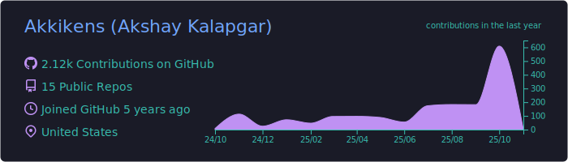
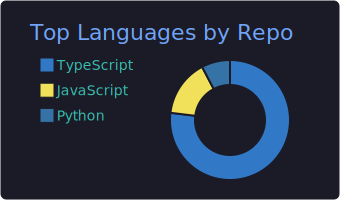
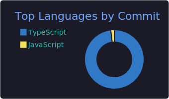

  

  &nbsp;
  &nbsp;
  

---

### What I'm building

**@ [Softmax](https://www.softmaxai.com)** — Infra & platform on [Metta](https://github.com/Metta-AI/metta), an open-source multi-agent RL research platform

- **Datadog + OpenTelemetry** observability pipeline — metric emission, OTLP receivers, structured collectors replacing SQLite legacy
- **K8s event processing** — watcher service for job lifecycle, event storage, Helm deploy fixes
- **Terraform** — Lambda, Secrets Manager, IAM for GitHub webhook services
- **CI/CD hardening** — cancelled-run cleanup, failure classification (timeout/OOM/policy_error), keeping main green
- **Alembic migrations** — PostgreSQL + SQLModel ORM, baseline migration for 21-table schema

**@ [Climb Together](https://climbtogether.com)** — AI Full Stack on [Goldi](https://github.com/climb-together/goldi), an AI career coaching platform

- **Voice mode** — Hume AI integration, audio interruption handling, emotional intelligence
- **Walmart partnership** — custom onboarding, archetype targeting (Explorer/Directed/Networker)
- **Playlist architecture** — URL-driven, multi-playlist, race condition fixes, navigation caching
- **WhatsApp + SMS** — consent integration, accountability follow-ups, +28% re-engagement

---

### Impact

<table>
<tr>
<td align="center"><strong>-50%</strong> Lambda cold starts</td>
<td align="center"><strong>99.9%</strong> Service uptime</td>
<td align="center"><strong>-40%</strong> First Contentful Paint</td>
<td align="center"><strong>-55%</strong> API latency</td>
<td align="center"><strong>+28%</strong> Re-engagement</td>
<td align="center"><strong>500+</strong> Tests written</td>
</tr>
</table>

---

### Tech stack

  
   
  

  
  
  
  
  
  

  
  
  
  

---

### GitHub stats

  

  
  
  

  

  

---

### Featured work

<table>
<tr>
<td width="33%">
<a href="https://github.com/Metta-AI/metta"><strong>Metta</strong></a> 
Open-source multi-agent RL platform @ Softmax. Observability, CI/CD, Terraform, DB migrations.
</td>
<td width="33%">
<a href="https://github.com/climb-together/goldi"><strong>Goldi</strong></a> 
#1 contributor. AI career coaching. Voice mode, Walmart integration, playlist arch. Next.js + Claude AI.
</td>
<td width="33%">
<a href="https://github.com/weng-lab/Factorbook2.0"><strong>Factorbook 2.0</strong></a> 
Genomics AI platform @ UMass Chan. Led frontend rebuild. -40% FCP, 500+ tests, -55% API latency.
</td>
</tr>
</table>

---

<strong>AI Full Stack Engineer</strong> — Softmax · Climb Together 
Previously @ UMass Chan Medical School · Capgemini (BMW) · tag8 · KPMG 
M.S. Computer Science, Clark University · AWS Certified Developer · San Francisco, CA

